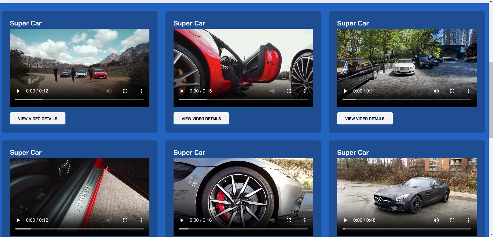

# Blog Site

#### By Reuben Kipkemboi

## Table of Content

+ [Description](#description)
+ [Installation Requirement](#installation-requirements)
+ [Technology Used](#technologies-used)
+ [License](#license)
+ [Authors Info](#authors-info)

## Description
Objectives During this bootcamp and hackathon, we will create a Blog website, we are aiming to:

- Understand JSON
- Understand how to work with Static files in Django
- Understand API
- Understand software development & Deployments
- Understand software testing with pytest
- Understand Database integration with Python Django


[Go Back to the top](#blog-site)


## User Stories

User Can :-

* View Random quotes from the random quote API.
* Users can view super car videos from the pexels API.

[Go Back to the top](#blog-site)

Quotes


Car Videos




Video Details


## Installation Requirements

### Prerequisites

- Django
- Pip & Python


## Instructions
   
##### Clone Repository:  
 ```bash 
https://github.com/Reuben-Kipkemboi/Agric.git 
```
##### Install and activate Virtual Environment virtual  
 ```bash 
cd <projectname> && python3 -m venv virtual && source virtual/bin/activate 
```  
##### Install Dependencies  
 ```bash 
 pip install -r requirements.txt 
```  
 
##### Run Application  
 ```bash 
 python3 manage.py runserver 

 or
 ./manage.py runserver
```
##### Test Application  
 ```bash 
 python manage.py test <appname>
```
Open the application on your browser `127.0.0.1:8000`.  

[Go Back to the top](#blog-site)


## Technologies Used


## License
[](https://opensource.org/licenses/MIT)

[MIT License](LICENSE)


## Author's Info

 :email: [Reuben Kipkemboi](https://gmail.com)  

<p align = "center">
    &copy; 2024 @Reuben Kipkemboi.
</p>
